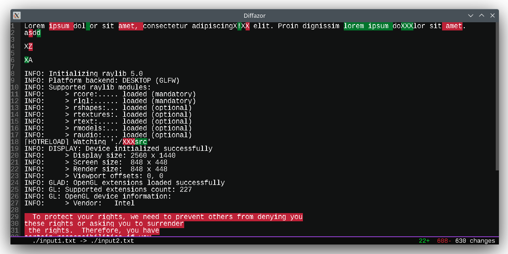

# Diffazor
Diffazor is basic text diff virtualization project.




We use the Longest Common Subsequence algorithm to find common letters.
This algorithm places strings on both sides of a two-dimensional matrix and
compares whether they are the same letter for each pair i,j.
We mark the common letters in the table so that we can find the common letters.
Then, the elements of the two strings are compared by going through the matrix and
adding or deleting situations are determined.

This is pure c project and it only depends on [Raylib](https://www.raylib.com/) (located on `./raylib-5.0`) for creating graphics.

Diffazor has hot-reload feature for development. All logics and drawing jobs in
`plugin.c` file. `main.c` file only load `libplugin.so` file using dynamic library
functions and create window.

**Table of Contents**:

- [setup](#setup-code)
  - [install](#install-source-code)
  - [run](#run-code)
- [structure of project](#structure-of-project)
- [development](#development)
- [contributing](#contributing)
- [license](#license)

> [!WARNING]
> This is experimental project, **DO NOT USE** in prod!

## Setup Code

### Install
Clone this project using GIT

```bash
git clone git@github.com:saracalihan/diffazor
```

Go into directory

```bash
cd diffazor
```

Now, you **have to compile raylib**. Please read [raylib readme](./raylib-5.0/README.md).

After the compile of reylib,

Compile all source code:

```bash
make
```

This command compile and link main executable and libplugin.

### Run Code

Run main executable:
```bash
./build/main
```

## Structure of Project

## Development
If you have only made improvements related to memory management or drawing,
run the following command while the `main` executable is running:

A new thread is created in the `main.c` file and this thread listens to
all files under the `src` folder and runs the "make hotreload" command
in case of any changes (save, update or delete) so that when you update
the code, it is automatically compiled.

You can turn this feature off and on from the `src/config.h` file and
determine which files will excluded in this feature.

Then press the `r` key in the user interface. When you press the `r` key,
the current application data (memory, variables, etc.) is kept in the
`Plugin` struct and `libplugin.so` is reopened and the values are restored.

## Contributing
This project accepts the open source and free software mentality in its main terms.
Development and distribution are free within the framework of the rules specified
in the license section, BUT the course and mentality of the project depends entirely
on my discretion.

**Please respect this mentality and contributing rules**

## License
This projct is under the [GNU GENERAL PUBLIC LICENSE](./LICENSE).
